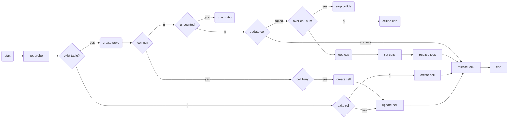

# Striped64理解

## 关键

* table为延迟加载的基于一个Cell类的并发累加器
* table拓容为2的倍数,且不允许超过cpu个数
* Cell的hash原则为线程基于一个probe的hashcode策略，
* Cell的目的是减少cas的无效处理场景
* Cell通过sun.misc.Contented进行long padding
* probe的目的是减少线程的hash碰撞问题
* cell拓容采用spinlock方案保证安全
* 因为生命周期短，可重用，Cell对应的线程销毁之后cell不会被销毁；
  
## 流程

