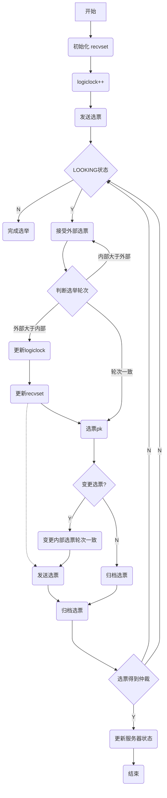

# ZAB协议
## 角色
1. leader
2. follower
3. observer
## 状态
1. looking 选举中状态
2. leading leader状态
3. following follower的状态
4. 节点数据状态
   1. history： 当前节点接收到的事务提议的log
   2. acceptedEpoch：follower节点已接受的leader更改编号newepoch提议
   3. currentEpoch：当前所处的epoch
   4. lastZxid:history中最近的zxid   
## 步骤：
1. 选举(election)
   1. 默认用fast paxos进行选出leader
   2. 触发时机：新建集群，leader死了，leader丢失一半以上的follower
   3. 选举过程（参考）
        * 进入looking状态，并且投票给自己，发送消息给其他机器内容：
            ```
            <第几轮投票，被投节点的zxid，被投节点的编号>
            ```
        * 接收消息方操作1判断票是否有效（轮数与本地记载是否一致）
        * 分三种情况1.低于本地投票，丢弃；2.大于，修改本地，并且通知其他节点，3.相等，比较优先级，优先级>=的情况下更新，小的时候忽略
2. 发现(discovery)
   1. leader选出acceptedEpoch中最大的e，发送newepoch(e+1)到follower
   2. follower判断是否newepoch>=acceptedEpoch,大于则进入phase2，<则设置为选举状态（election）进入选举步骤
   3. 通知leader节点查找quorum中最大currentEpoch和lastZxid对应的follower节点信息，更新leader的节点数据信息为该follower的节点信息，进入同步步骤
3. 同步(sync)
   1. 发现之后获得准leader，准leader将最新提议历史同步到所有FOLLOWER
   2. Follower对当前的数据状态进行校验，成功则设置更新数据，并回复leader ACKNEWLEADER(e,H)，失败则设置为选举状态(election) 重新选举
   3. 准leader收到follower消息回复COMMIT，follower进入正常提交事务状态；进入广播状态
4. 广播(Broadcast)
   1. 正式提供事务服务阶段，leader接收到写请求v广播到follower
   2. follower接收到消息写入历史log，返回ack响应
   3. leader接收到ack发送commit到follower
   4. follower按照zxid依次处理事务后提交

## 其他
1. 少数服从多数原则
   1. 选举过程有一半以上节点达成一致选举结束
   2. 广播过程，事务只要一半以上支持，事务成功
   3. 少数服从多数可以保证集群分裂也存在至少一个公共节点
   4. 集群数量最好为奇数
2. ZAB实现合并发现阶段和同步阶段华为恢复阶段
3. zookeeper中选举阶段需要服务器互通，由设置的大的sid连接小sid机器
   

